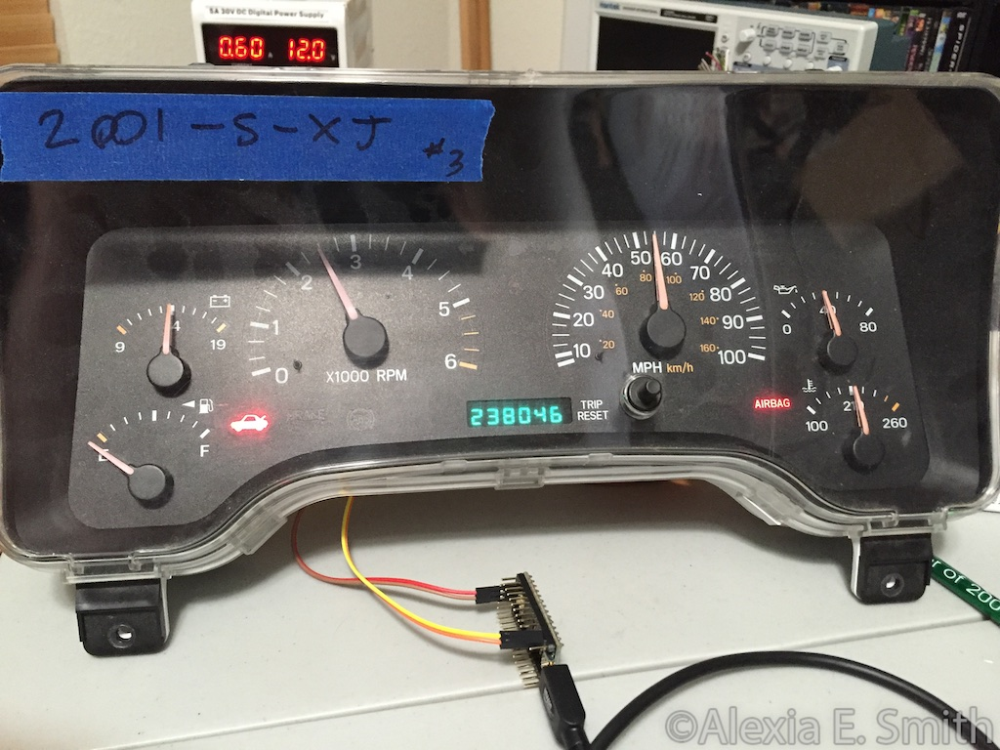

# VAG CAN bus to CCD bus Protocol Translator
CAN bus to CCD bus protocol translator for Atmel Cortex ARM on layer 1 and 2 of communication in the network.  This project is in the prototype stages.  The final goal is to be able to place a device between the CAN bus on a VW TDI EDC16 and the CCD bus of a XJ Jeep Cherokee.  The old modules include a gauge cluster and an air bag module.

##Required Hardware
###AVR Board
Any AVR with a dedicated hardware UART and either a SPI port to run a can transciever or a dedicated CAN interface

###CAN Transceiver
The CAN bus will utilize a standard CAN transceiver.  Using 5 volt transceivers is recommend for best compatibility, but 3.3 volt transceivers do work. A [Waveshare SN65HVD230 CAN Transceiver Board](https://www.amazon.com/gp/product/B00KM6XMXO/) is being used for reverse engineering and testing currently.

* 3.3 volt option
 * TI SN65HVD230 series.
* 5 volt options
 * NXP TJA1050T/VM,118
 * Microchip MCP2551
 
If you do not have a dedicated CAN interface, you will need to provide one. Initially I played with a MCP2515 over SPI to datalog my CAN based ECU.
 
###CCD Transceiver

Intersil made a chip for Chrysler to support the CCD bus, the CDP68HC68S1. It is called a SBIC, or serial bus interface chip. This chip has a SPI and a serial interface. I am using the serial interface and monitoring it's idle pin to avoid a collision on the CCD bus. All packets transmitted out the UART are reflected across the rx side of the UART by the SBIC.

CCD::busTransmit() is the function where the magic happens. It sends a packet and monitors for the reflected packet to return, compairing the length of what was transmitted to what was reflected.

CCD::busTransmitValidate() is a function that attempts to follow the logic in the datasheet, however it doesn't seem to work and might be too latent for the cluster to function.

##FAQ
###What vehicles does this device cover?
Early 1980s to early 2000s Chrysler, Dodge, Jeep, and Plymouth models that utilized CCD bus communications.

###Does the device transmit on the CAN bus?
At the moment there are not plans to translate messages on the CCD bus over to the CAN bus.  My intended use is to translate the VAG CAN protocol to CCD to drive the instrument cluster in my Jeep. Some of the values used by the Jeep cluster are not available on the CAN, however are expected by the ECU and will be transmitted as such. To start, distance (speed), fuel level, and oil pressure are not available. Temperature, distance, and fuel leters are expected by the ecu and will be transmitted. This will require additional hardware.

###Additional sensors
As mentioned, I need to measure 

*speed/distance
 *For speed I will use the Jeep sensor in the transfer case CCD will get speed and distance ticks, and CAN will get speed
*oil pressure
 *Oil pressure will be a GM 0-5v sensor off of a late model LS3 since it is readily available and of a known pressure scale
*fuel level
 *I will be using a fuel pickup out of a Dodge 2500 with as 5.9L cummins. The scale is unknown but likely standard.

